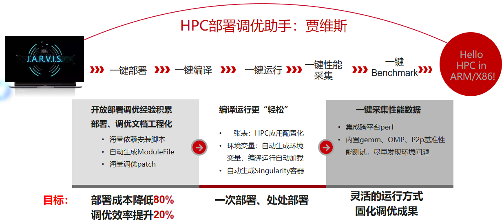

# HPCRunner : 贾维斯智能助手
## ***愿景：在任意机器的任意目录部署最优化HPC应用***

### 项目背景

​        HPC被喻为是IT行业“金字塔上的明珠”，其部署、编译、运行、性能采集分析的门槛非常高，不同的机器上部署HPC应用耗费大量精力，而且很多情况下需要同时部署ARM/X86两套环境进行验证，增加了很多的重复性工作，无法聚焦核心算法优化。



### 项目特色

- 支持ARM/X86,一键部署，采用业界权威依赖目录结构管理海量依赖，自动生成module file
- 根据HPC配置实现一键编译运行、一键CPU/GPU性能采集、一键Benchmark.
- 所有配置仅用一个文件记录，HPC应用部署到不同的机器仅需修改配置文件.
- 日志管理系统自动记录HPC应用部署过程中的所有信息.
- 软件本身无需编译开箱即用，仅依赖Python环境.
- HPC应用容器化-目前QE已经实现，参考container目录.
- (未来) 集成HPC领域常用性能调优手段、核心算法.
- (未来) 集群性能分析工具.
- (未来) 智能调优.

### 目录结构

| 目录/文件 | 说明                               | 备注     |
| --------- | ---------------------------------- | -------- |
| benchmark | 矩阵运算、OpenMP、MPI、P2P性能测试 |          |
| doc       | 文档                               |          |
| downloads | 存放依赖库源码包/压缩包            |          |
| examples  | 性能小实验                         |          |
| package   | 存放安装脚本和FAQ                  |          |
| software  | 依赖库二进制仓库(内置精度分析工具)         | 自动生成 |
| src       | 贾维斯源码                         |          |
| templates | 常用HPC应用的配置模板              |          |
| test      | 贾维斯测试用例                     |          |
| workloads  | 常用HPC应用的算例合集              |          |
| init.sh   | 贾维斯初始化文件                   |          |
| jarvis    | 贾维斯启动入口                     |          |

### 已验证HPC应用

分子动力学领域：

- [x] CP2K

- [x] Amber

- [x] QE

- [x] VASP

气象领域：

- [x] WRF

流体力学领域：

- [x] OpenFOAM


### 使用说明

1.下载包解压之后初始化

```
source ./init.sh
```

2.修改data.config或者套用现有模板，各配置项说明如下所示：

|    配置项    | 说明                                                         | 示例                                                         |
| :----------: | :----------------------------------------------------------- | :----------------------------------------------------------- |
|   [SERVER]   | 服务器节点列表，多节点时用于自动生成hostfile，每行一个节点   | 11.11.11.11                                                  |
|  [DOWNLOAD]  | 每行一个软件的版本和下载链接，默认下载到downloads目录(可设置别名) | cp2k/8.2 https://xxx cp2k.8.2.tar.gz                         |
| [DEPENDENCY] | HPC应用依赖安装脚本                                          | ./jarvis -install gcc/9.3.1 com<br>module use ./software/modulefiles<br>module load gcc9 |
|    [ENV]     | HPC应用编译运行环境配置                                      | source env.sh                                                |
|    [APP]     | HPC应用信息，包括应用名、构建路径、二进制路径、算例路径      | app_name = CP2K<br/>build_dir = /home/cp2k-8.2/<br/>binary_dir = /home/CP2K/cp2k-8.2/bin/<br/>case_dir = /home/CP2K/cp2k-8.2/benchmarks/QS/ |
|   [BUILD]    | HPC应用构建脚本                                              | make -j 128                                                  |
|   [CLEAN]    | HPC应用编译清理脚本                                          | make -j 128 clean                                            |
|    [RUN]     | HPC应用运行配置，包括前置命令、应用命令和节点个数            | run = mpirun -np 2 <br/>binary = cp2k.psmp H2O-256.inp<br/>nodes = 1 |
|   [BATCH]    | HPC应用批量运行命令                                          | #!/bin/bash<br/>nvidia-smi -pm 1<br/>nvidia-smi -ac 1215,1410 |
|    [PERF]    | 性能工具额外参数                                             | perf= -o<br/>nsys=<br/>ncu=--target-processes all --launch-skip 71434 --launch-count 1 |

3.一键下载HPC应用（仅针对无需鉴权的链接，否则需要自行下载到downloads目录）

```
./jarvis -d
```

4.安装单个依赖

```
./jarvis -install [package/][name/version/other] [option]
```

option支持列表如下所示

| 选项值      | 解释                          | 安装目录                  |
| ----------- | ----------------------------- | ------------------------- |
| gcc         | 使用当前gcc进行编译           | software/libs/gcc         |
| gcc+mpi     | 使用当前gcc+当前mpi进行编译   | software/libs/gcc/mpi     |
| clang       | 使用当前clang进行编译         | software/libs/clang       |
| clang+mpi   | 使用当前clang+当前mpi进行编译 | software/libs/clang/mpi   |
| bisheng     | 使用毕晟进行编译              | software/libs/bisheng     |
| bisheng+mpi | 使用毕晟+当前mpi进行编译      | software/libs/bisheng/mpi |
| nvc         | 使用当前nvc进行编译           | software/libs/nvc         |
| nvc+mpi     | 使用当前nvc+当前mpi进行编译   | software/libs/nvc/mpi     |
| icc         | 使用当前icc进行编译           | software/libs/icc         |
| icc+mpi     | 使用当前icc+当前mpi进行编译   | software/libs/icc/mpi     |
| com         | 安装编译器                    | software/compiler         |
| any         | 安装工具软件                  | software/utils   |

注意，如果软件为MPI通信软件（如hmpi、openmpi），会安装到software/mpi目录

eg: 

```
./jarvis -install bisheng/2.1.0 com   #安装毕晟编译器
./jarvis -install package/bisheng/2.1.0 com   #安装毕晟编译器
./jarvis -install fftw/3.3.8 gcc+mpi   #使用当前gcc和mpi编译fftw 3.3.8版本
./jarvis -install openmpi/4.1.2 gcc   #使用当前gcc编译openmpi 4.1.2版本
```

5.一键卸载依赖

```
./jarvis -remove openblas/0.3.18
```

6.一键下载并安装所有依赖（会读取配置文件中的[DEPENDENCY]字段内容并按顺序执行）

```
./jarvis -dp
```

7.输出已安装的软件清单

```
./jarvis -l
```

8.查询已安装的软件

```
./jarvis -f xxx
```

9.一键生成环境变量(会读取配置文件中的[ENV]字段内容并生成env.sh脚本执行，默认自动生成)

```
./jarvis -e && source ./env.sh
```

10.一键编译（会读取配置文件中的[BUILD]字段内容并生成build.sh脚本执行）

```
./jarvis -b
```

11.一键运行（会读取配置文件中的[RUN]字段内容并生成run.sh脚本执行）

```
./jarvis -r
```

12.一键性能采集(会读取配置文件中的[PERF]字段内容的perf值)

```
./jarvis -p
```

13.一键GPU性能采集(需安装nsys、ncu)

```
./jarvis -gp
```

14.一键输出服务器信息(包括CPU、网卡、OS、内存等)

```
./jarvis -i
```

15.一键服务器性能评测(包括MPI、OMP、P2P等)

```
./jarvis -bench all    #运行所有benchmark
./jarvis -bench mpi    #运行MPI benchmark
./jarvis -bench omp    #运行OMP benchmark
./jarvis -bench gemm   #运行矩阵运算 benchmark
```

16.切换配置(配置文件路径会保存到.meta文件中)

```
./jarvis -use XXX.config
```

17.根据当前配置生成Singularity容器定义文件

```
./jarvis -container docker-hub-address
eg: ./jarvis -container openeuler:openeuler
```

18.其它功能查看（网络检测等）

```
./jarvis -h
```

### 路标


### 欢迎贡献

贾维斯项目欢迎您的专业技能和热情参与！

小的改进或修复总是值得赞赏的；先从文档开始可能是一个很好的起点。如果您正在考虑做出更大贡献，请提交一个issue或者在hpc.openeuler.org进行讨论。

编写代码并不是为贾维斯做出贡献的唯一方法。您还可以：

- 贡献安装脚本
- 帮助我们测试新的HPC应用
- 开发教程、演示
- 为我们宣传
- 帮助新的贡献者加入

请添加openEuler HPC SIG微信群了解更多HPC部署调优知识


### 技术文章

揭开HPC应用的神秘面纱：https://zhuanlan.zhihu.com/p/489828346

我和容器有个约会：https://zhuanlan.zhihu.com/p/499544308